# flisp 数据处理流程图

## 1. 顶层架构图

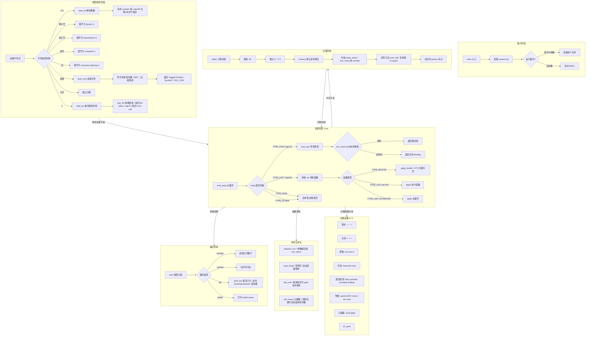

## 2. 数据表示层 — 值编码

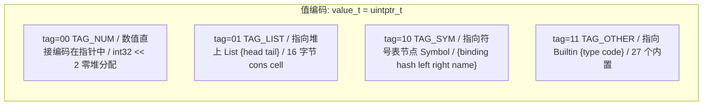

## 3. 详细求值流水线 — 以 `(add 3 4)` 为例

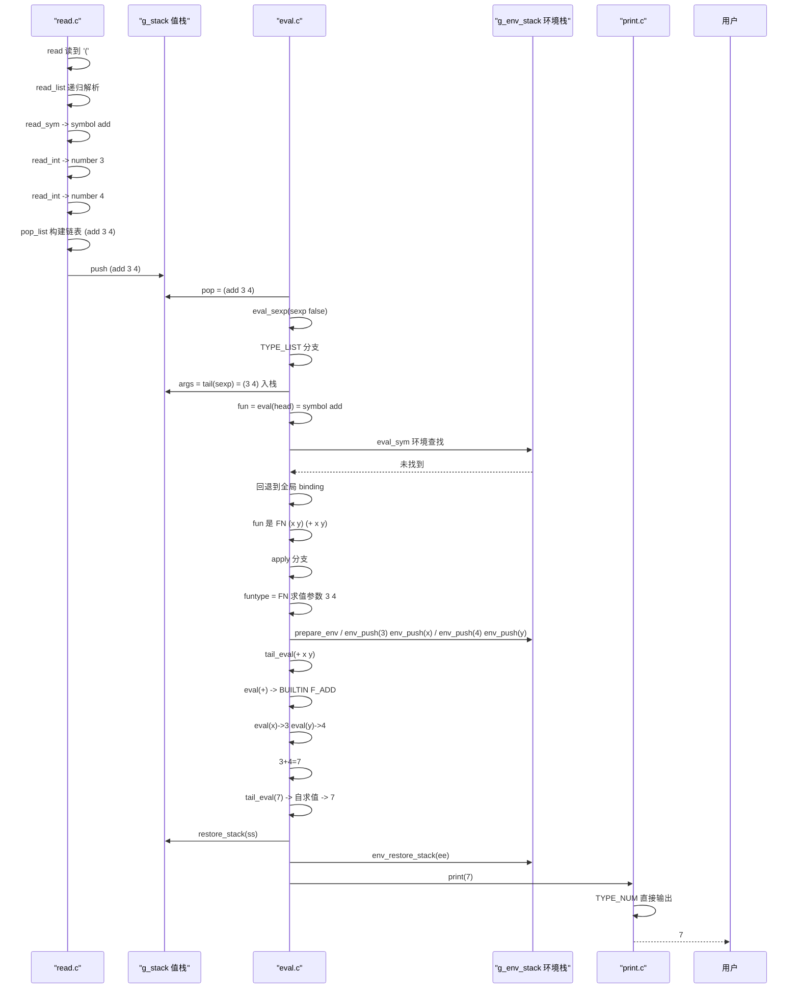

## 4. 宏展开流程 — `(unless #t (print 1))`

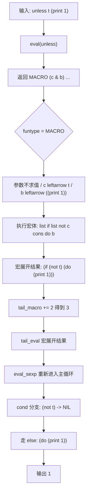

## 5. 闭包捕获流程 — `(let ((x 42)) (fn (y) (+ x y)))`

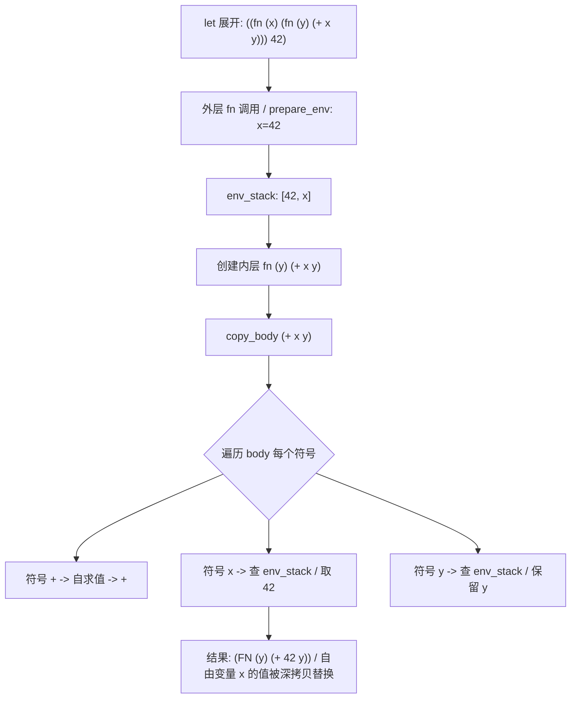

## 6. 运行时状态全景

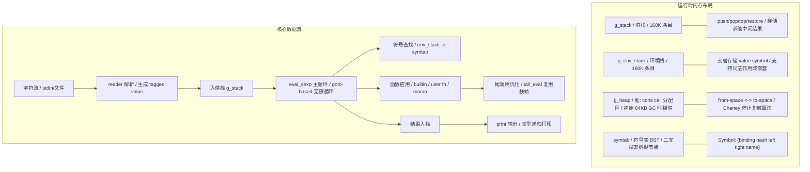

## 7. 启动流程

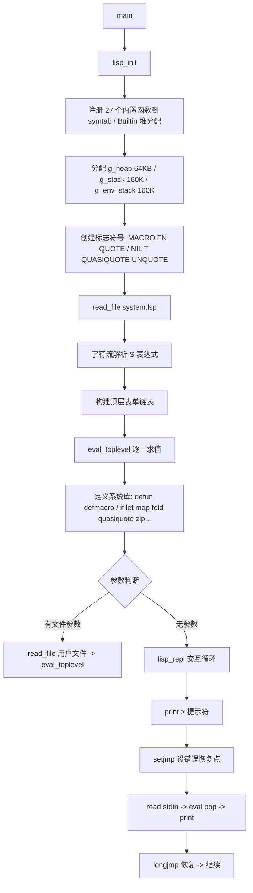

## 8. eval 详细流程图

### 8.1 eval_sexp 主循环完整结构

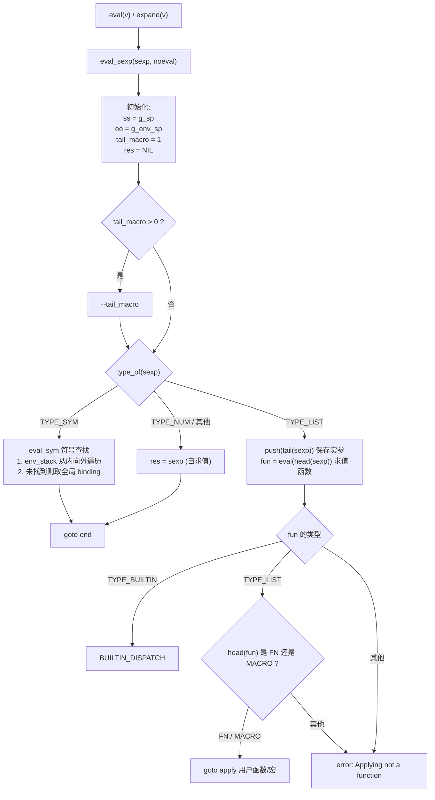

### 8.2 builtin 分发与特殊形式

```mermaid
flowchart TD
    BUILTIN_IN["code = builtin_val(fun)->code<br/>args = pop() 取出实参列表"] --> CHECK_CODE{"code >= F_ADD ?"}

    CHECK_CODE -->|"是 (普通函数)"| FUNC_PREP["push_reverse_list(args) 参数入栈<br/>逐个 eval 求值参数"]
    FUNC_PREP --> SWITCH

    CHECK_CODE -->|"否 (特殊形式)"| SWITCH["switch(code) 分发"]

    SWITCH --> F_ADD["F_ADD: 累加<br/>sum = num_val(pop)<br/>while g_sp>ss: sum += num_val(pop)"]
    SWITCH --> F_SUB["F_SUB: 累减<br/>nargs==1 时取负"]
    SWITCH --> F_MUL["F_MUL: 累乘"]
    SWITCH --> F_DIV["F_DIV: 累除<br/>除零检查"]
    SWITCH --> F_LT["F_LT: < 比较"]
    SWITCH --> F_GT["F_GT: > 比较"]
    SWITCH --> F_EQ["F_EQ: = 比较<br/>eqp 递归比较列表"]
    SWITCH --> F_NOT["F_NOT: 逻辑非<br/>v==NIL -> T, 否则 NIL"]

    SWITCH --> F_HEAD["F_HEAD: 取 head"]
    SWITCH --> F_TAIL["F_TAIL: 取 tail"]
    SWITCH --> F_CONS["F_CONS: cons 构造"]
    SWITCH --> F_LISTP["F_LISTP: list? 类型检测"]
    SWITCH --> F_SYMBOLP["F_SYMBOLP: symbol? 类型检测"]
    SWITCH --> F_NUMBERP["F_NUMBERP: number? 类型检测"]
    SWITCH --> F_BUILTINP["F_BUILTINP: builtin? 类型检测"]

    SWITCH --> F_PRINT["F_PRINT: 循环打印所有参数"]
    SWITCH --> F_EVAL["F_EVAL: 元循环 eval<br/>eval(g_stack[ss])"]
    SWITCH --> F_APPLY["F_APPLY: 应用<br/>fun=pop; is_apply=true; goto apply_top"]

    SWITCH --> B_FN["B_FN / B_MACRO: 闭包创建"]
    SWITCH --> B_COND["B_COND: cond 条件分支"]
    SWITCH --> B_DO["B_DO: do 顺序求值"]
    SWITCH --> B_QUOTE["B_QUOTE: quote 阻止求值"]
    SWITCH --> B_DEF["B_DEF: def 全局定义"]
    SWITCH --> B_OR["B_OR: 短路或"]
    SWITCH --> B_AND["B_AND: 短路与"]

    B_FN --> FN_DETAIL["见 8.4 闭包创建"]
    B_COND --> COND_DETAIL["见 8.6 cond 详解"]
    B_DEF --> DEF_DETAIL["见 8.5 def 详解"]
    B_OR --> OR_DETAIL["循环 eval, 第一个真值返回"]
    B_AND --> AND_DETAIL["循环 eval, 第一个 NIL 返回"]

    SWITCH --> DEFAULT["default: error"]
    DEFAULT --> ERR_RET
    F_ADD --> RET
    F_SUB --> RET
    F_MUL --> RET
    F_DIV --> RET
    F_LT --> RET
    F_GT --> RET
    F_EQ --> RET
    F_NOT --> RET
    F_HEAD --> RET
    F_TAIL --> RET
    F_CONS --> RET
    F_LISTP --> RET
    F_SYMBOLP --> RET
    F_NUMBERP --> RET
    F_BUILTINP --> RET
    F_PRINT --> RET
    F_EVAL --> RET
    F_APPLY --> RET
    B_OR --> RET
    B_AND --> RET

    RET["res = 计算结果<br/>goto end"]
    ERR_RET["error 触发 longjmp"]
```

### 8.3 用户函数/宏应用 (apply)

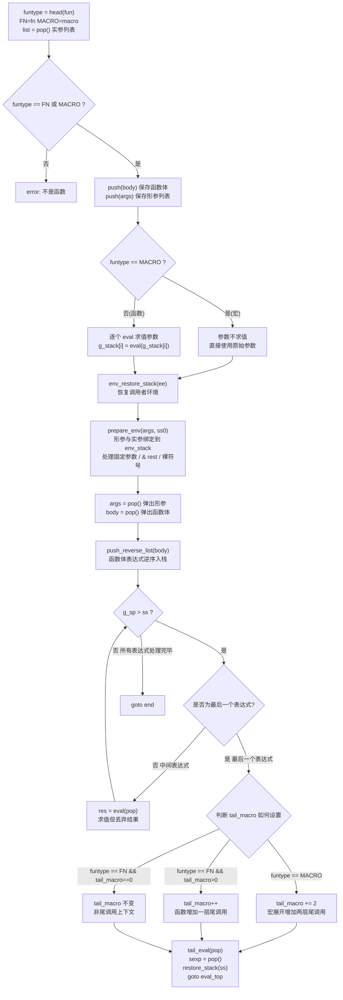

### 8.4 闭包创建 (B_FN / B_MACRO)

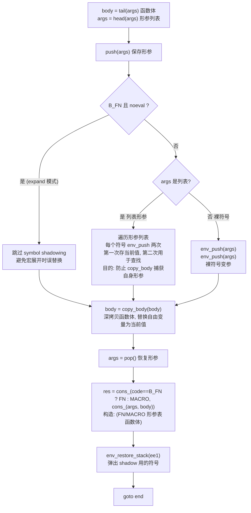

### 8.5 copy_body 详细流程 (深拷贝+闭包捕获)

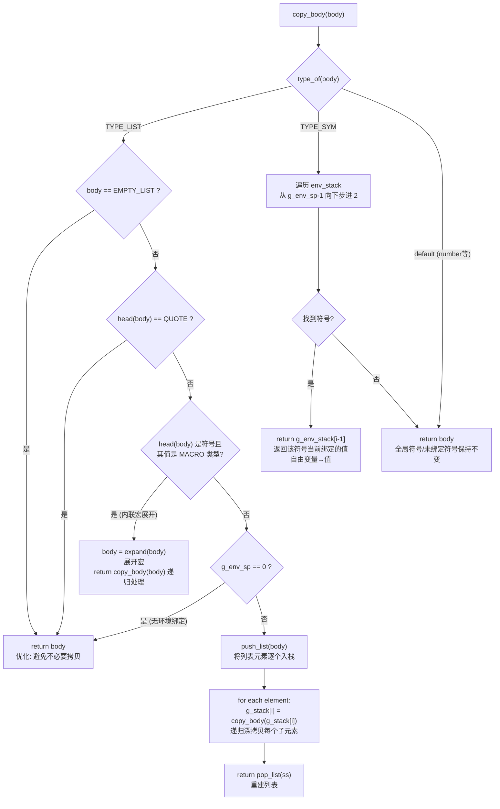

### 8.6 cond 特殊形式详解

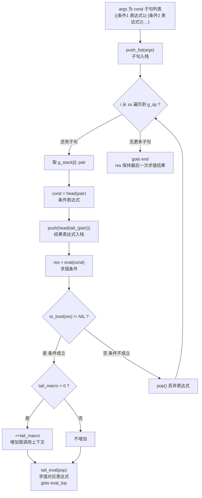

### 8.7 def 全局定义详解

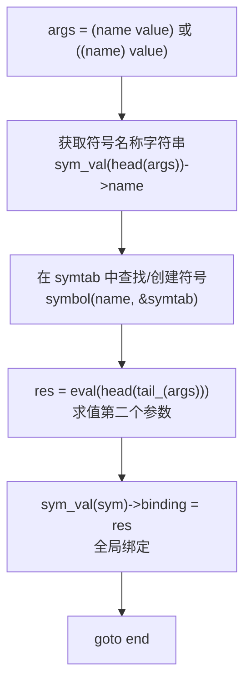

### 8.8 eval_sym 符号查找详细流程

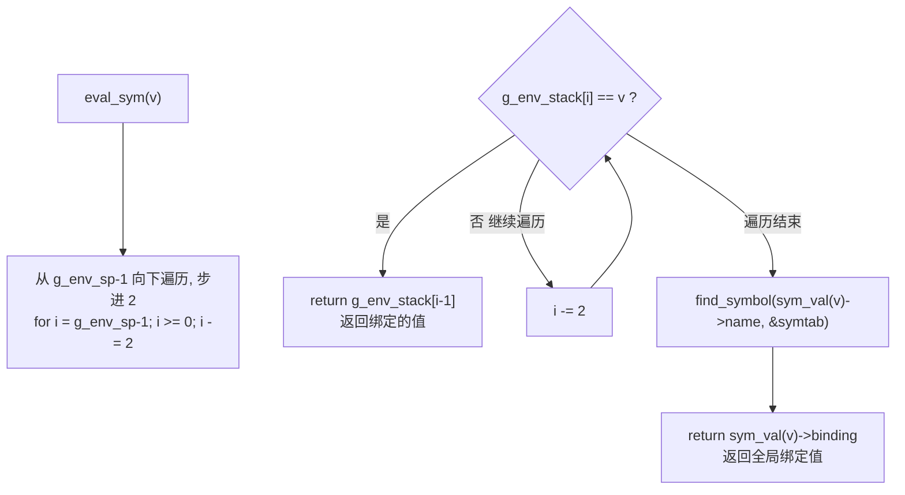

### 8.9 prepare_env 参数绑定详细流程

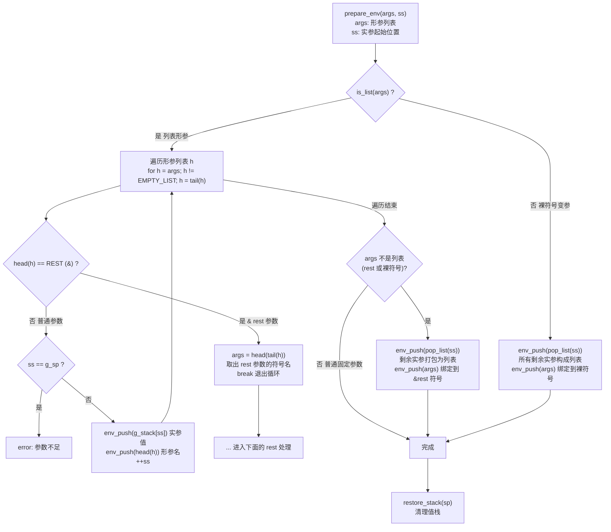

### 8.10 tail_macro 生命周期管理

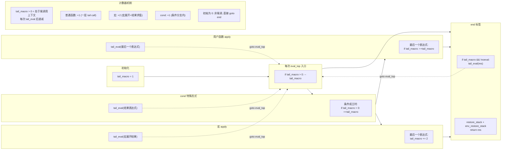

### 8.11 完整求值链路示例 — `((fn (x) (add x 1)) 41)`

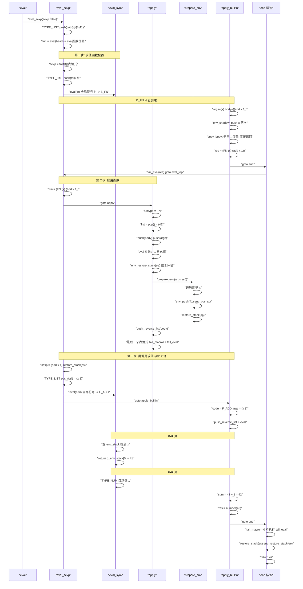

### 8.12 eval 模块函数依赖图

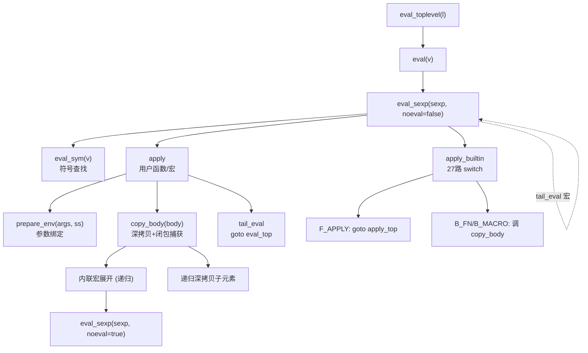

## 关键设计要点

| 阶段 | 核心文件 | 关键机制 | 数据格式 |
|------|----------|----------|----------|
| **读取** | `lisp_read.c` | 递归下降解析器, 语法糖展开 | 字符流 -> tagged value (AST) |
| **求值** | `lisp_eval.c` | goto 主循环, 尾调用优化, 深拷贝闭包 | tagged value -> tagged value |
| **环境** | `lisp_eval.c` | 环境栈交替存储, prepare_env 绑定 | value/symbol 配对栈 |
| **内置** | `lisp_eval.c` | X-macro 枚举27个, switch 分发 | Builtin {type code} |
| **打印** | `lisp_print.c` | 类型分发, 递归列表打印 | tagged value -> 字符串 |
| **GC** | `lisp_core.c` | Cheney 停止复制, heap *1.5 扩容 | from-space -> to-space |
| **符号** | `lisp_symbol.c` | BST 二叉搜索树, 哈希键 | Symbol 节点 |
